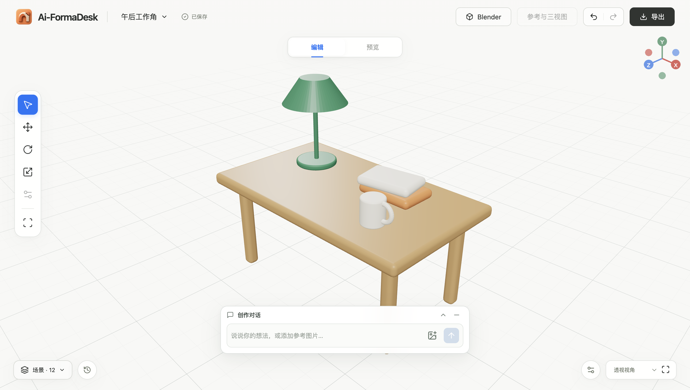
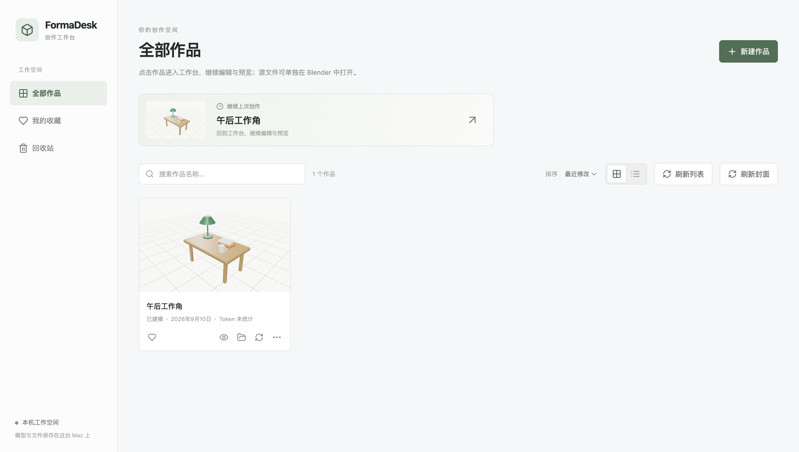
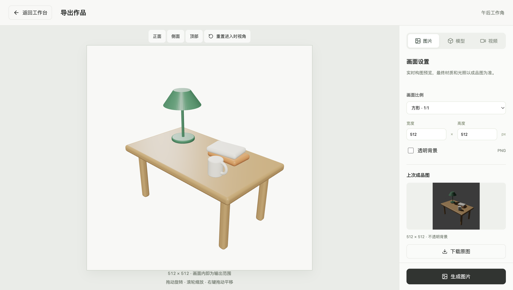

<div align="center">
  
  <h1>FormaDesk</h1>
  <p><strong>把想法，做成可以继续编辑的三维作品。</strong></p>
  <p>用自然语言创作，在工作台里调整，在 Blender 里继续。</p>
  <p>
    <a href="https://github.com/damingishere-coder/Ai-FormaDesk/releases/latest"></a>
    
    
    <a href="https://github.com/damingishere-coder/Ai-FormaDesk/actions/workflows/ci.yml"></a>
  </p>
  <h3><a href="https://github.com/damingishere-coder/Ai-FormaDesk/releases/latest">下载 macOS 桌面版 ↗</a></h3>
  <p><a href="docs/DESKTOP.md">安装指南</a> · <a href="docs/WORKBENCH.md">开始创作</a> · <a href="docs/README.md">文档中心</a> · <a href="CHANGELOG.md">更新记录</a> · <a href="https://github.com/damingishere-coder/Ai-FormaDesk/issues">反馈问题</a></p>
</div>



<p align="center"><sub>实际应用界面 · 示例作品由 Blender 脚本创建 · 可编辑场景与实时预览</sub></p>

## 从想法到交付，留在同一个工作台

描述想法、加入参考图片，与 Codex 讨论方案；Blender 在本机生成场景。旋转查看、选择部件、调整位置和材质，再继续对话。成功的修改保存为版本，可以撤销、重做，也可以回到先前的作品。

你的交付物是 **`.blend` 源文件、`.glb` 模型、PNG 图片和视频**。FormaDesk 管理创作过程与交付，Blender 保留完整的场景编辑能力。

| 描述与创作 | 查看与修改 | 保存与交付 |
| :--- | :--- | :--- |
| 自然语言与参考图片 | 大画布、对象选择与变换 | Blender 源文件与通用模型 |
| 讨论方案，再执行建模 | 材质调整、撤销与历史版本 | 自定义比例、透明背景 PNG |
| 查看任务阶段和失败信息 | 在 Blender 中继续编辑 | 实时录制与 Blender 精细视频 |

## 1.1：让每一件作品都好找、好接着做

**从作品首页开始。** 搜索、收藏、排序，切换卡片或列表；需要编辑时才加载三维模型。作品文件集中展示，模型、图片和视频都有清晰的入口。



- **源文件直接打开**：从作品菜单进入 Blender；可选“我的作品”插件支持读取本地缓存，在 Blender 内打开源文件。
- **参考图片分区浏览**：原图、三视图、材质贴图和检查图分别展示；大图支持前后切换与键盘操作。
- **录完之后继续操作**：录制结果可返回录制、导出设置或工作台；上传失败时保留录制结果供重试。
- **用量可追溯**：作品卡片累计显示 Codex token 用量；记录不完整和未统计的情况单独标记。
- **封面可以刷新**：按需生成合适取景的封面，刷新不会修改模型版本。

<details>
<summary><strong>查看图片与模型导出界面</strong></summary>



实时预览用于确认构图，最终材质和光照以保存版本的 Blender 渲染为准。

</details>

## 三步开始

1. **安装应用**：从 [最新发布](https://github.com/damingishere-coder/Ai-FormaDesk/releases/latest) 下载 DMG，将 Ai-FormaDesk 拖入“应用程序”。
2. **准备运行环境**：安装 Blender 4.5 LTS，准备已经登录的 Codex CLI。应用内置 Node.js、前端和后台依赖，不需要安装 npm。
3. **开始创作**：打开应用，新建作品，在创作框里描述想法。已有作品可以直接从首页继续。

提供 **macOS 13+ / Apple Silicon** 安装包。实际验收环境与版本边界见 [1.1 发布记录](docs/releases/1.1.0.md)。当前包使用本机 ad-hoc 签名，尚未经过 Apple Developer ID 签名与公证；首次打开请参考 [安装指南](docs/DESKTOP.md#首次打开)。

> 已有作品：先退出旧工作台，再通过应用菜单选择原来的 `data` 目录。保留目录原位置；覆盖安装不会覆盖作品与路径设置。

## 你的作品，保存在本机

默认数据目录为 `~/Library/Application Support/Ai-FormaDesk/data`。备份前退出工作台，再复制完整数据目录。索引包含绝对路径，当前支持原位接入旧目录，暂不支持任意路径迁移。

界面、后台、Blender 和作品文件在本机运行；**AI 推理需要网络和可用的 Codex 账户额度**。工作台复用已有登录，不修改全局提供商或认证配置。后台只监听回环地址，桌面会话、文件归属与 Blender 执行边界分别校验。

图片建模仍是实验能力，不保证照片精确重建。当前适合单物体、产品概念和小场景；复杂拓扑、雕刻、多人协作不在保证范围内。实时视频帧率取决于设备与场景。

## 开发与参与

```sh
git clone https://github.com/damingishere-coder/Ai-FormaDesk.git
cd Ai-FormaDesk
npm ci
npm run desktop:dev
```

| 层 | 技术 |
| :--- | :--- |
| 桌面应用 | Electron · 原生菜单与保存对话框 |
| 三维画布 | React · TypeScript · Three.js / React Three Fiber |
| 本地服务 | Node.js · Fastify · SQLite |
| 建模与渲染 | Blender 4.5 LTS · Python |
| AI | 本机 Codex App Server |

开发、验证和打包入口见 [开发指南](DEVELOPMENT.md)，修改约定见 [贡献指南](CONTRIBUTING.md)。问题反馈请包含版本、复现步骤与截图，并移除私人信息。

感谢 [Blender](https://www.blender.org/)、[Electron](https://www.electronjs.org/)、[Three.js](https://threejs.org/) 与 [blender-mcp](https://github.com/ahujasid/blender-mcp)。本仓库尚未指定项目级开源许可证；第三方依赖遵循各自许可证。

<p align="center"><sub>Ideas become objects. Keep shaping.</sub></p>
