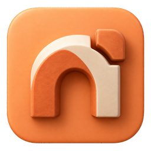
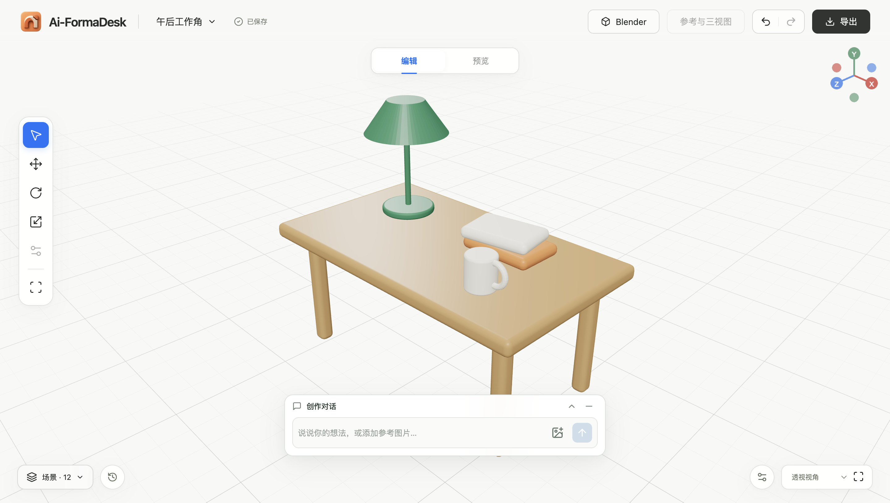
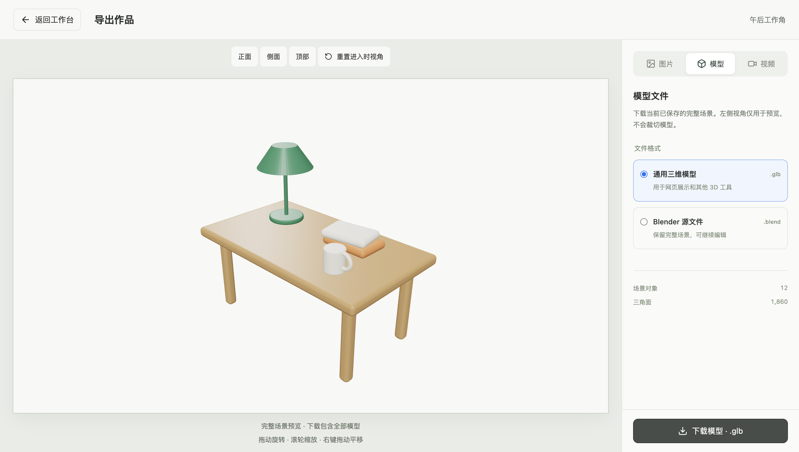

<div align="center">
  
  <h1>FormaDesk · 造物工作台</h1>
  <p><strong>把想法，做成可以继续编辑的三维作品。</strong></p>
  <p>自然语言创作 · 实时三维编辑 · Blender 源文件 · macOS 桌面应用</p>
  <p>
    <a href="https://github.com/damingishere-coder/Ai-FormaDesk/releases/latest"></a>
    
    
    <a href="https://github.com/damingishere-coder/Ai-FormaDesk/actions/workflows/ci.yml"></a>
  </p>
  <p>
    <a href="https://github.com/damingishere-coder/Ai-FormaDesk/releases/latest"><strong>下载桌面应用</strong></a> ·
    <a href="docs/DESKTOP.md">安装指南</a> ·
    <a href="docs/WORKBENCH.md">使用文档</a> ·
    <a href="https://github.com/damingishere-coder/Ai-FormaDesk/issues">反馈问题</a> ·
    <a href="CHANGELOG.md">更新记录</a>
  </p>
</div>

<p align="center"></p>

## 从一句话，到一件作品

FormaDesk 是一个运行在 Mac 上的三维创作工作台。你描述想法，Codex 生成建模脚本，Blender 在本机创建真实场景。接着在同一个窗口里旋转观察、选择部件、调整位置和材质，再继续对话。

最终作品可以保存为 **可编辑的 `.blend` 源文件**、通用 `.glb` 模型、图片和视频。界面、后台与数据都在本机；AI 请求由已有 Codex 账户处理。

## 一个窗口，完成创作与交付

| 创作 | 编辑 | 交付 |
| :--- | :--- | :--- |
| 文字描述、参考图片、方案讨论 | 实时三维画布与对象选择 | `.blend` / `.glb` 模型 |
| 将方案交给 Blender 执行 | 移动、旋转、缩放和材质调整 | 自定义构图与透明 PNG |
| 保留生成过程与失败信息 | 撤销、重做、历史版本和作品库 | 实时录制与 Blender 精细视频 |

- **桌面即工作台**：独立应用窗口、原生菜单、程序坞入口和系统保存对话框。应用自动管理本地后台。
- **作品可继续修改**：保存场景对象和版本，后续修改基于当前场景；失败任务保留诊断并保住成功版本。
- **大画布，按需展开**：底部悬浮创作框；场景列表、属性、历史与导出面板按需出现。
- **本机 Blender 联动**：可选安装 Blender MCP 后，在 Blender 中打开工作副本，调整并同步回来。

<details>
<summary>查看统一导出界面</summary>



</details>

> 图片建模仍是实验能力：三视图和生成的可编辑几何不能保证与照片精确一致。1.0 更适合单物体、产品概念和小场景。

## 开始使用

1. 从 [Releases](https://github.com/damingishere-coder/Ai-FormaDesk/releases/latest) 下载 Apple Silicon 版 DMG，将 **Ai-FormaDesk** 拖入“应用程序”。
2. 准备 **Blender 4.5 LTS** 和已经登录的 **Codex CLI**；应用已内置前端、Node.js 与后台依赖，不需要另装 npm。
3. 打开应用，在右下角检查运行环境，然后描述你的第一个作品。

首版提供 **macOS 13+ / Apple Silicon** 安装包，实际桌面验收平台见 [发布验收记录](docs/DESKTOP-ACCEPTANCE.md)。Intel Mac、Windows 和 Linux 安装包尚未提供。当前构建未经过 Apple Developer ID 签名与公证，首次打开说明见 [安装指南](docs/DESKTOP.md#首次打开)。

老版本作品可以通过应用菜单选择现有 `data` 文件夹继续使用。**先退出旧工作台，保留数据目录原位置**，无需导入或重新建模。

## 它如何工作


| 层 | 技术 |
| :--- | :--- |
| 桌面 | Electron，界面隔离与本机后台生命周期管理 |
| 编辑画布 | React · TypeScript · Three.js / React Three Fiber |
| 本地服务 | Node.js · Fastify · SQLite |
| 三维执行 | Blender 4.5 LTS · Python · macOS Seatbelt |
| AI 集成 | 本机 Codex App Server |

## 数据与边界

默认数据位置为 `~/Library/Application Support/Ai-FormaDesk/data`。使用旧作品目录时继续在原位置读写。备份请先退出工作台，再备份完整数据目录；数据索引包含绝对路径，暂不支持直接把副本移到新路径使用。

后台只监听回环地址。桌面模式额外使用随机窗口凭据，接口继续校验本地会话与写操作。界面不启用 Node.js 集成；生成脚本的执行边界由 Blender 沙箱控制。Codex 模型提供商、登录方式与全局认证配置保持不变。

AI 功能需要联网和可用额度；项目不会把“本机保存”描述为完全离线 AI。实时录制目标为 60 fps，实际帧率取决于设备与场景。复杂拓扑编辑、雕刻、多人协作和照片精确重建不在 1.0 保证范围内。

## 本地开发

```sh
git clone https://github.com/damingishere-coder/Ai-FormaDesk.git
cd Ai-FormaDesk
npm ci
npm run desktop:dev
```

```sh
npm test                  # 单元测试
npm run build             # 类型检查与前端构建
npm run desktop:dist      # 构建 Apple Silicon DMG / ZIP
npm run test:desktop      # 独立数据目录中的桌面冒烟验收
```

源码调试仍可使用 `npm run dev` 和 `npm run dev:web`。完整配置、数据结构、快捷键和验证入口见 [工作台文档](docs/WORKBENCH.md) 与 [桌面开发说明](docs/DESKTOP.md)。

## 参与改进

欢迎通过 [Issues](https://github.com/damingishere-coder/Ai-FormaDesk/issues) 提交复现步骤、使用反馈或功能建议。提交修改前请阅读 [贡献指南](CONTRIBUTING.md)。分享截图或日志前，请移除账号信息、个人路径和参考图中的私人内容。

感谢 [Blender](https://www.blender.org/)、[Electron](https://www.electronjs.org/)、[Three.js](https://threejs.org/) 与 [blender-mcp](https://github.com/ahujasid/blender-mcp) 等上游项目。它们的商标及许可属于各自权利人。

<p align="center"><sub>Made for ideas you can shape.</sub></p>
