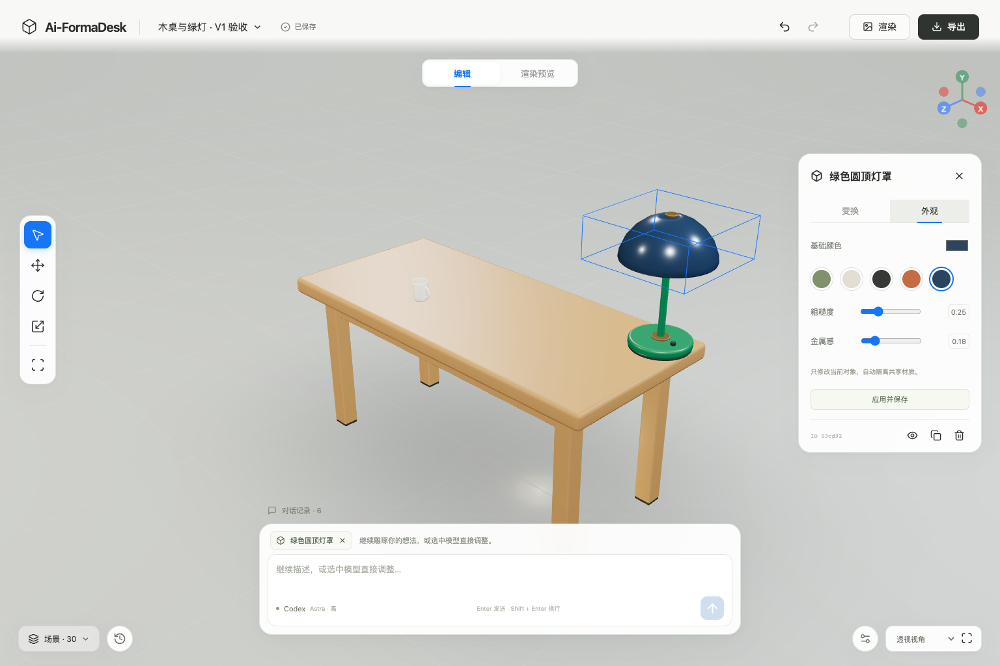
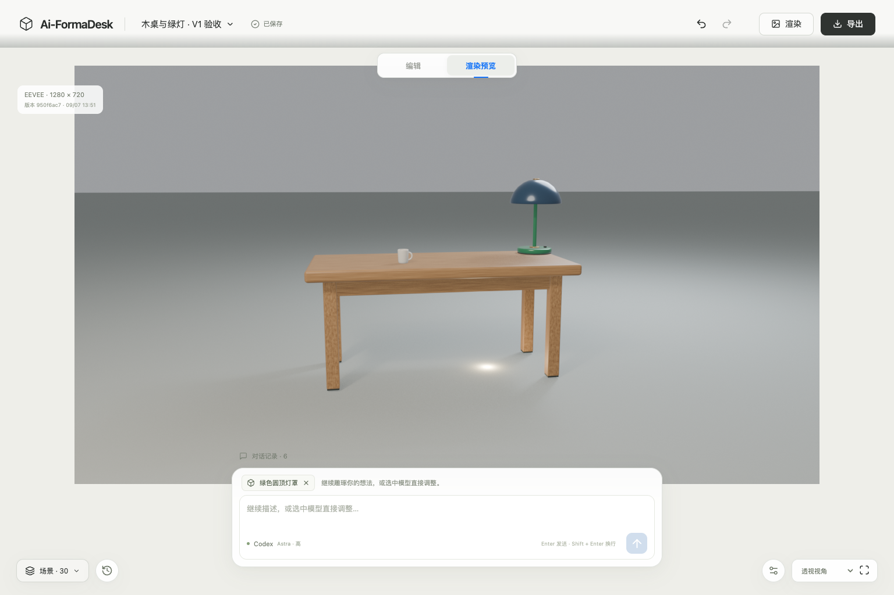

# V1 验收记录

日期：2026-09-07。验收在本机 macOS Apple Silicon 上执行，未使用模拟 AI、模拟 Blender、静态模型或假进度作为成功证据。

## 环境

- Node.js 22.15.1；本机 Google Chrome 152。
- Codex CLI **0.153.4**；官方 App Server 标准输入输出协议；ChatGPT 原有登录。
- 实时模型列表及真实生成：**gpt-6-astra / high**，没有切换提供商或认证，没有启用子代理。
- Blender **4.5.13 LTS / arm64**，来自官方 release 目录。
- 安装包 SHA-256：`663ce944257c61ff1d6aa09e15c8f57bbd8d59023adb2fa7edde33a9ed960b53`，与官方校验文件一致。
- 安装位置：`/Applications/Blender 4.5 LTS.app`。未替换其他安装。

## 验收结果

| 文档验收项 | 实际证据与结果 |
| --- | --- |
| 首次生成 | Chrome 中输入木桌和绿色台灯；真实 Codex 生成 Python，Blender 执行并生成 `.blend`、GLB、场景清单。最终回归首版有 29 个对象。 |
| 手动编辑 | 网页移动台灯、旋转 15°、桌子 X 缩放 1.1、灯罩改为 `#2c455e`。刷新后保留；独立 Blender 进程重开文件，场景清单一致。实际鼠标拖动也产生新版本，刷新和撤销均通过。 |
| 继续对话 | 手动保存后“增加一个杯子”，原台灯、桌子和灯罩 ID、位置、旋转、缩放和颜色保留。 |
| 选择与属性 | 场景列表、蓝色轮廓、以物体中心定位的变换控件、属性面板和对话上下文一致。复制后用不同 ID 选择具有相同名称前缀的物体，不靠名称匹配。复制、隐藏、显示、删除及灯光颜色/强度编辑通过真实浏览器检查。 |
| 版本恢复 | 撤销、重做、恢复首版、恢复编辑版后继续 AI 修改均通过；新版本父节点正确，原历史文件仍保留。 |
| 渲染与导出 | EEVEE 使用提交版本和相机参数生成 1280×720 PNG；在 Chrome 下载 `.blend`、GLB 和 PNG；后续场景修改使旧图标记过期，恢复对应版本后解除过期。 |
| 异常处理 | 真实 Python 错误不破坏成功场景；长任务取消；实际渲染时 SIGKILL 后台、重启清理残留 Blender 进程并标记失败；API 取消、SSE 断线重连终态、独立空白 CODEX_HOME 未登录、Blender 路径不存在、旧版本提交拒绝均通过。 |
| 执行限制 | 建模和受信任渲染两套沙箱均实际拒绝越界读取、越界写入、回环网络及外网连接，返回 EPERM；执行环境无 Codex 凭据。两项同时提交的真实 Blender 检查按全局队列顺序执行。Host、Origin、会话和 CSRF 拒绝测试通过。 |
| 视觉和快捷键 | 本机 Chrome 1536×1024、1280×800；大画布、底部悬浮对话框、按需属性面板；面板与主要对话操作无交叠。输入 `wer` 不切换画布工具。 |

## 可复核的本地记录

运行数据不提交 Git，以下文件位于项目 `data` 目录，可在本机检查：

- `data/acceptance/browser-result.json`：完整真实流程通过；最终回归用时约 3.9 分钟，浏览器未捕获页面异常。
- `data/acceptance/first-scene.json`、`edited-scene.json`、`final-scene.json`：首版、编辑版及导出对应场景。
- `data/acceptance/reopen-result.json`：编辑版与最终导出版在独立 Blender 进程重开，比对对象、层级、变换、材质和灯光一致。JSON 的正负零按相同数值比较。
- `data/acceptance/drag-result.json`：实际鼠标拖拽，位置从 `[0.35, 0, 0]` 变为约 `[0.43744, 0.02343, 0]`，随后撤销恢复。
- `data/acceptance/object-actions-result.json`：复制、稳定 ID 选择、隐藏、显示、删除和灯光编辑。
- `data/integration/*/results.json`：真实 Blender 集成和全局队列检查。
- `data/fault-checks/*/results.json`：隔离数据目录中的故障注入；后一次执行的全部检查通过。
- `data/jobs/*/attempt-*/generated.py`、`execution.log`：实际 AI 脚本及 Blender 结果。早期失败记录也保留，便于审计修复。

最终完整回归项目：`f069b0de-a486-48df-9491-aa9500777056`。

- 首版：`6979e214-ff1c-4d31-b669-b9a5929170a5`
- 手动编辑版：`f643144d-501e-4720-8c53-f5df46322f30`
- 增加杯子版：`89013130-0a2b-4af5-9e0b-2713325af742`
- 历史分支、渲染和导出版本：`950f6ac7-88ec-4045-aed8-f739c0e0a8d7`

## 已知边界

- 网页 PBR/灯光是实时近似；完整程序化木纹与最终光照以 Blender PNG 为准，不承诺两个渲染器像素一致。
- 固定 PNG 为 16:9，保留相机方向与垂直视野，浏览器纵横比不同时水平画幅有所差异。
- 只验收本机 Apple Silicon、小场景和桌面 Chrome；未验证其他操作系统、大型场景、移动端、长期无人值守或真实账户额度耗尽。额度错误处理已实现，但没有人为消耗账户至耗尽来测试。
- 历史版本、失败任务和日志尚不自动清理，需按 README 备份后管理磁盘空间。
- 系统 Chrome 扩展的自动化入口曾拦截回环地址；验收使用文档要求的 Playwright 独立 Chrome 会话完成，未修改用户浏览器的安全设置。
- 未部署；PR 只用于审阅，不自动合并。

交付时另一次检查：从已停止状态执行 Mac 启动入口，在用户当前 Chrome 中打开工作台、切换到最终验收项目并点击“渲染”，界面实际返回“EEVEE 渲染已保存”。原有 CLI 版本和 ChatGPT 登录状态再次确认正常。

## 实际界面

